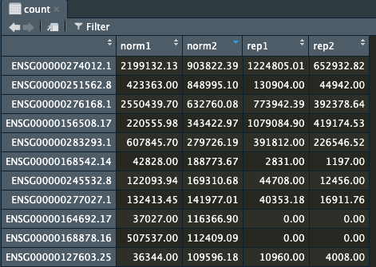
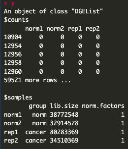
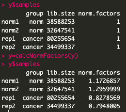
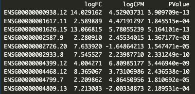

# EdgeR查找差异表达基因  
内容主要来源：  
[https://bioconductor.org/packages/release/bioc/vignettes/edgeR/inst/doc/edgeRUsersGuide.pdf](https://bioconductor.org/packages/release/bioc/vignettes/edgeR/inst/doc/edgeRUsersGuide.pdf)（官方使用文档）
## 数据来源  
癌症细胞：`Encode`上`NCI-H460`癌症细胞系`total RNA-Seq`数据，因为`Encode`已经给出了基因定量的数据文件，故无需再重复跑一次产出定量文件的流程。  
正常细胞：仍然来自于`Encode`,选用的正常肺组织的`total RNA-Seq`的基因定量文件。  
   
## 过程  
### 基因定量信息  
***Files need to contain two columns, one for the counts and one for a gene identifier.***  
 所需的定量文件共两列，一列基因，一列基因的数量。从Encode上下载下来的文件内容是这样的:  
   
***Note that edgeR is designed to work with actual read counts. We not recommend that predicted transcript abundances are input the edgeR in place of actual counts.***  
根据文档，要求我们使用初始的基因读数，这里使用了`gene_id`和`expected_count`两列组成EdgeR的输入数据文件。  
 
**读入初始数据:**  
> rep1=read.table("./NCI-H460.totalRNA.geneQA.rep1.tsv",header =  TRUE)  
> rep2=read.table("./NCI-H460.totalRNA.geneQA.rep2.tsv",header =  TRUE)  
> norm1=read.table("./lung.toalRNA.geneQA.rep1.tsv",header =  TRUE)  
> norm2=read.table("./lung.toalRNA.geneQA.rep2.tsv",header =  TRUE)  

 

**提取所需两列:**  

>rep1=rep1[,1:5]  
>rep1=rep1[,-c(2:4)]  

其他rep2、norm1、norm2按照同样操作即可。  
 
**汇成总表：**  
> count=merge(norm1,norm2,by="gene\_id")  
> colnames(count)=c("gene\_id","nomr1","norm2")  
> count=merge(count,rep1,by='gene\_id')  
> count=merge(count,rep2,by='gene\_id')  
> colnames(count)=c('gene\_Id','norm1','norm2','rep1','rep2')  
> row.names(count)=count$gene\_Id  
> count=count[,-c(1)]  

  
 
**转换成DGEList类型：**  
分组并转换：
> group=c("norm","norm","cancer","cancer")  
> y=DGEList(counts=count,group = group)  

  
如图上所示，rep1与rep2的lib.size的差异有点大。重新检查了下，确认并没有下载错误的文件，那么作为试水，继续进行下去吧。  
 
**过滤低表达基因：**    
从生物学的角度来看，一个基因必须在某种最低水平上表达，才有可能被翻译成蛋白质或具有生物学上的重要性。此外，这些计数的显著离散性也干扰了后面流程中使用的一些统计近似过程。  
  
直接用`filterByExpr`进行过滤:  
> keep=filterByExpr(y,group = group)  
> y=y[keep,,keep.lib.sizes=FALSE]  

*keep应该是逻辑类型的向量，它其中代表的意义是哪些基因应该留下来，哪些基因该被筛选出去，故有第二步，需要根据keep对y做处理，才是真正意义上的筛选。*  

### Normalization（标准化）
此时y中的样本之间仍然无法进行比较，样本的表达量是在相对不同的条件下测得的，而我们又恰恰需要观察样本之间本身的差异，需要将它们标准化。  
EdgeR标准化没有将基因长度和GC含量作为主要因素，它把Sequencing depth和Effective library sizes作为标准化主要的方向。
 
直接进行标准化：`y = calcNormFactors(y)`  
  
`norm.factors`发生了变化。  
*We call the product of the original library size and the scaling factor the effective library size. The effective library size replaces the original library size in all downsteam analyses*  
在下面的分析中都是以这个`effective library size`为准。    
`effective library size = original library size * norm.factors`  
 
### 查找差异基因  
**经典的edgeR分析：**  
*edgeR uses the quantile-adjusted conditional maximum likelihood (qCML) method for experiments with single factor*  
  
该方法适用于单因子。  
直接上命令:  
`y = estimateDisp(y)`  
`et = exactTest(y)`  
`topTags(et)`  
  
显示的是norm组和cancer组之间的靠前显著基因。  
如果想要更进一步进行筛选的话，可以按照`et$table`中的四个列进行筛选。  
如：logFC > 2 并且 p值 < 0.05  
`ed = et$table[which(et$table$logFC > 2 & et$table$PValue < 0.05),]`  
  
 
**转换基因名**  
来源：[https://github.com/twbattaglia/RNAseq-workflow](https://github.com/twbattaglia/RNAseq-workflow)  
`library(org.Hs.eg.db)`  
`sy = mapIds(x = org.Hs.eg.db,keys = substr(row.names(ed),1,15),keytype = 'ENSEMBL',column = 'SYMBOL',multiVals = 'first')`  
`ed$symbol = sy`  
*注意事项：转换的时候，ENSGXXXXXXXXXX.XX，需要去除小数点以及小数点后两位的数字。*  
  

## 后续
1.下游分析（GO、KEGG）以及可视化（热图，火山图）。  
2.原理（长期）。

